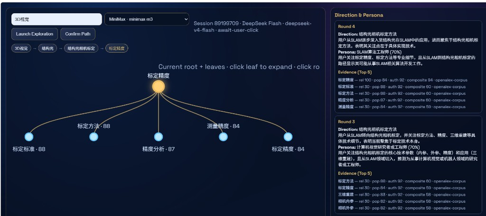
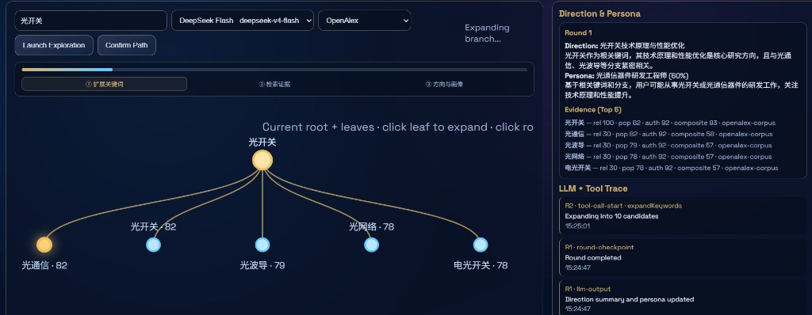

# Keyword Star Atlas MVP

[中文文档](README-cn.md)

A human-in-the-loop exploration system—not a traditional search box. Enter a seed keyword and co-discover direction through recursive clarification: expand, rank, visualize, click, repeat.

## Screenshots



*Seed “3D vision” → four rounds of recursive clarification: star-map tree, path breadcrumb, direction & persona panel, and Top 5 evidence scores.*



*Expanding from “光开关”: LLM + evidence DB pickers, three-step round progress, and trace rows labeled with each candidate keyword searched.*

## Product beliefs

1. Better questions beat faster answers
2. Relational maps inspire thinking more than linear lists
3. Transparent process beats opaque “smart” boxes

## North star

Help users move from fuzzy intent to actionable direction—with a visible, replayable, auditable path.

Success is measured by convergence quality, explainability, and reusable exploration trails—not single-shot hit rate.

## Core loop

Each round:

1. User picks a focus node
2. LLM expands 10 candidate keywords
3. Evidence scoring ranks Top 5
4. Star-map tree visualizes branches
5. User clicks a node to recurse—or confirms to freeze the path

## UX controls

| Action | Gesture |
|--------|---------|
| Expand next round | Click node |
| Select node to confirm | Shift+click |
| Freeze path | **Confirm Path** button |
| Filter trace by round | Ctrl+click node |
| Highlight tree from trace | Click trace row |

## Explainability

Every round shows:

- **Direction summary** — where the model thinks you are converging
- **Persona hypothesis** — staged guess at your goal
- **Evidence scores** — relevance, popularity, authority for Top 5 leaves

Trace panel records LLM outputs and tool calls; rows link bidirectionally to tree nodes (ADR-002).

## Visual language

Dark deep-space canvas, gold orbital links, cool-white highlights—exploration depth flows left → right.

## MVP scope

- Seed → 10 candidates → Top 5 tree → recursive clicks
- Direction, persona, evidence per round
- Full trace timeline with tree linkage
- Confirm / freeze path

Out of scope: auth, multi-user editing, ops rule engine.

## Quick start

```bash
npm install
npm run dev    # builds client bundle, serves http://localhost:3000
npm test
```

Copy [.env.example](.env.example) to `.env` and set `KIMI_API_KEY` or `MINIMAX_API_KEY`. The server refuses to start without an LLM key. Leaf heat comes from the [OpenAlex](https://openalex.org) bibliometric API (publication volume, citations, trends, co-occurring terms).

### LLM providers

**Kimi:** `KIMI_API_KEY` (+ optional `KIMI_BASE_URL`, `KIMI_MODEL`). Keys prefixed `sk-kimi-` use `https://api.kimi.com/coding/v1`.

**MiniMax:** `LLM_PROVIDER=minimax`, `MINIMAX_API_KEY` (+ optional base URL / model).

Priority: MiniMax (if configured) → Kimi. Missing key → startup error.

## Architecture ADRs

See [docs/adr/0001-mvp-architecture.md](docs/adr/0001-mvp-architecture.md).

## Agent workflow

Issues and PRDs live under `.scratch/`. See [AGENTS.md](AGENTS.md) and [CONTEXT.md](CONTEXT.md).
